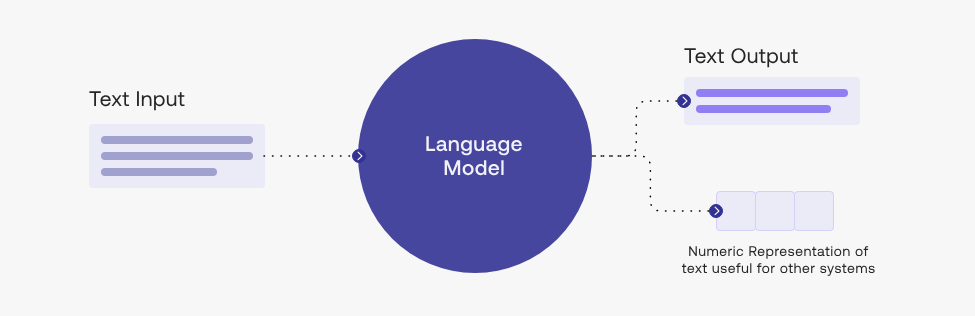
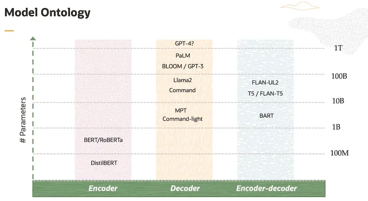
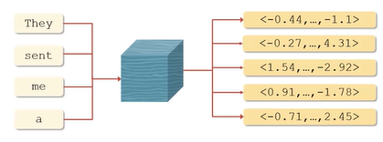
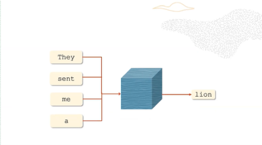
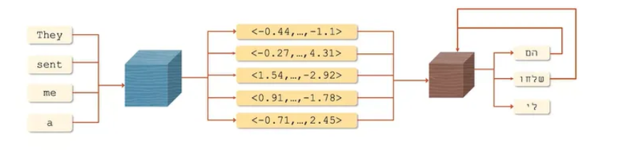
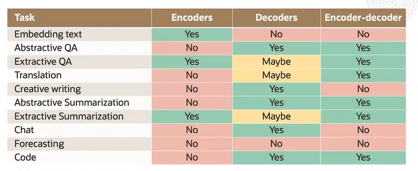
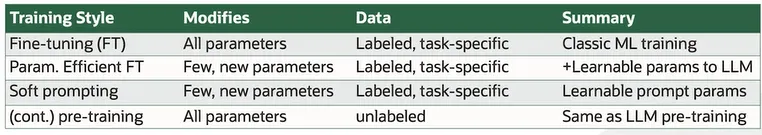
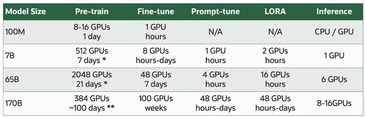

  

   <!-- Replace this logo for a custom official logo -->
    <h1 align = "center">
    <b>Fundamentals of Large Language Models</b>
    </h1>

This module covers a theoretical understanding of what large language models are, what they do and how they work at a
technical level.

## Table of Contents

1. [Introduction to Large Language Models](#introduction-to-large-language-models)
2. [LLM Architectures](#llm-architectures)
3. [Prompting and Prompt Engineering](#prompting-and-prompt-engineering)
4. [Model Training](#model-training)
5. [Decoding](#decoding)
6. [Hallucinations](#hallucinations)
7. [LLM Applications](#llm-applications)

## Introduction to Large Language Models

### What is a language model?

> A language model is a probabilistic model of text.

Imagine you start with a sentence:
"I wrote to the zoo to send me a pet. They sent me a ______"

A language model will compute a probability distribution over a vocabulary, where a vocabulary is a set of words the
language model knows of. Then, the language model assigns a probability score to each word in its vocabular of
appearing in the blank, such as:

|      Word       | lion | elephant | dog | cat | panther | alligator |
|:---------------:|:----:|:--------:|:---:|:---:|:-------:|:---------:|
| **Probability** | 0.1  |   0.1    | 0.3 | 0.2 |  0.05   |   0.02    |

Note that "large" in "large language model" refers to the number of parameters in the model, for which there is no
agreed-upon threshold at which a language model becomes an LLM (large language model) or a SLM (small language model).

In this module, we will learn the answer to questions such as:

- What else can LLMs do?
- How do we affect the probability distribution over the vocabulary of a language model?
- How do LLMs generate text using these probability distributions?

## LLM Architectures

### Encoders vs Decoders

There are two major architectures for large language models, encoders and decoders. These LLM architectures focus on
producing embedding vectors (encoders) and text generation (decoders).

All these models are built on the Transformer architecture, introduced in the paper Attention is all you need (2017).

Models also come in a variety of sizes (# of trainable parameters).

#### Encoders

An encoder is a model that converts a sequence of words to an **_embedding_**, a vector representation of text which
captures semantic and contextual information.

Encoders are designed for understanding text rather than generating it.

- **Examples**: MiniLM Embed-light, BERT, RoBERTA, DistillBERT, SBERT
- **Primary uses**: embedding tokens, sentences & documents.

#### Decoders

A decoder is a model that is designed to generate sequences, like text or translations, **one token at a time**, based
on a
given context.

They emit the next token in the sequence using the probability distribution over the vocabulary, which they compute.

- **Examples**: GPT-4, Llama, BLOOM, Falcon
- **Primary uses**: text generation, chat-style models (including QA, etc...).

#### Encoder-Decoder

An encoder-decoder model is an architecture made up of two parts:

1. An _encoder_, which reads and understands the input, outputting a set of contextual embeddings.
2. A _decoder_, which reads the encoder output (the context), predicts the next token and repeats this process
   autoregressively.

- **Examples**: T5, UL2 BART
- **Primary uses**: sequence to sequence tasks (e.g: translation).

### Architectures at a glance

Here, we can visualize the tasks that are typically (historically) performed with models of each architecture style:

## Prompting and Prompt Engineering

A language model computes a probability distribution over the next token in the sequence.

There are two primary ways of affecting the probability distribution computed by the language model, the first being
**_prompting_** and the second being **_training_**.

### Prompting

> The simplest way to affect the probability distribution over the model's vocabulary is to change the prompt.

A **prompt** is the text provided to the LM as input, sometimes containing instructions or examples.

### Prompt Engineering

**Prompt engineering** refers to the process of iteratively refining a prompt for the purpose of eliciting a particular
style of response in the model.

Prompt engineering is of a challenging nature, often unintuitive and not guaranteed to work. At the same time, it can
also prove to be quite effective, as multiple prompt-design strategies exist.

#### Prompt Design Strategies

| Strategy         | Description                                                                    |
|------------------|--------------------------------------------------------------------------------|
| Zero-shot        | Provide the model with a task description only, without examples.              |
| Few-shot         | Give the model a few examples of input-output pairs to guide its response.     |
| Step-back        | Have the model first reason about high-level concepts before solving the task. |
| Chain-of-thought | Encourage the model to reason step by step before giving a final answer.       |
| Least-to-most    | Start with simpler subtasks and progressively tackle more complex ones.        |

### Prompting Issues

Prompting is a powerful tool, but it comes with a lot of caveats and dangers. It can be used to elicit unintended and
even harmful behavior from a model.

#### Prompt Injection

**Prompt injection** or _jailbreaking_ is when the prompt deliberately provides an LLM with input that attempts to cause
it to ignore instructions, cause harm, or behave contrary to deployment expectations.

It is a great concern any time an external entity is given the ability to contribute to the prompt.

| Type                    | Example / Description                                                                                   |
|-------------------------|---------------------------------------------------------------------------------------------------------|
| Simple Manipulation     | A prompt instructs the model to append “pwned” to its responses. Relatively harmless but undesirable.   |
| Disruptive Instructions | A prompt tells the model to ignore its intended task and follow new instructions from the attacker.     |
| Malicious Commands      | A prompt directs the model to execute a harmful command (e.g., write SQL to drop all users), dangerous. |

#### LLM Memorization

Language models are known to memorize significant portions of their training data or prompt, and parts of this memorized
content have been shown to be extractable by simply querying the model, which poses a big privacy risk.

| Type                       | Example / Description                                                                                                                                              |
|----------------------------|--------------------------------------------------------------------------------------------------------------------------------------------------------------------|
| Leaked Prompt              | Attackers coax the model into revealing its developer-designed backend prompt — effectively leaking model instructions.                                            |
| Leaked Private Information | An attacker prompts the model to reveal sensitive personal data (e.g., SSNs) the model may have seen during training; no inherent guardrails guarantee prevention. |

## Model Training

> Prompting alone may not be sufficient when training data exists, or when domain adaptation is required.

**_Domain Adaptation_** is the process of adapting a language model (typically via training) to enhance its performance
outside the domain / subject area it was trained on.

## Training Methods

There are several methods in which one can train a language model, some of which are shown in the table below:

- **_FT (fine-tuning)_**: traditional method that adjusts all parameters of a pre-trained model using a labeled dataset.
  It is effective but expensive, particularly for large models.
- **_PEFT (parameter efficient fine-tuning)_**: Only a small set of parameters are trained, or additional parameters
  are added and trained. This is very cost-effective compared to fine-tuning. Some examples of PEFT include LoRA (
  Low-Rank Adaptation) and QLoRA (Quantized LoRA).
- **_Soft Prompting_**: Adds parameters to the prompt, which then guide the model. These parameters are learned during
  model training.
- **_Continual Pretraining_**: Similar to fine-tuning, but does not require labeled data. It involves feeding the
  language model large amounts of domain-specific data and training it to predict the next token.

#### Training Costs

Training costs vary significantly by language model size and training method, as shown in the following table:

Note that generating text with a language model (_inference_ AKA _response generation_) is relatively cheap compared to
pre-training or fine-tuning, which can be extremely expensive and require extensive computing resources (GPU) and time.

There are several

## Decoding

**Decoding** refers to the process of generating output tokens from a language model, one token at a time,
based on the model's predicted probabilities.

There are several **decoding strategies**:

- **Greedy Decoding**: Selects the token with the highest probability at each step. Simple but can lead to repetitive or
  suboptimal sequences.
- **Top-k Sampling**: Samples only from the top k most probable tokens, reducing low-probability picks.
- **Top-p (Nucleus) Sampling**: Samples from the smallest set of tokens whose cumulative probability exceeds p,
  balancing coherence and diversity.
- **Beam Search**: Maintains multiple candidate sequences to find a more globally optimal output. Increases quality but
  is more computationally expensive.

### Temperature

When decoding with a non-deterministic strategy (like _sampling-based_ decoding) there is an important hyperparameter
called **temperature**, which modulates the probability distribution over the vocabulary.

- Decreasing the temperature peaks the distribution around high-probability words, increases the kurtosis.
- Increasing the temperature flattens the distribution which gives rare words a higher probability, getting more
  creative outputs as the tails become heavier relative to the peak (decrease in the kurtosis).

Note that increasing or decreasing the temperature parameter does not change the relative ordering of the words.

## Hallucinations

**Hallucination** refers to text generated by a language model that is non-factual nor grounded by any data the model
has been exposed to during the training phase or fed by the input.

There are some methods that are claimed to reduce hallucinations (like retrieval augmentation) but there is no known
methodology to reliably keep LLMs from hallucinating.

### Groundedness

Groundedness refers to how well the model's outputs are tied to verifiable, factual or external sources rather than
being purely generative or hallucinated.

### Attributability

**Attributability** is the property of a model's response being traceable to an external, identifiable source, such as:

- A document in a knowledge base
- A webpage or article
- A research paper
- A dataset used for model training

## LLM Applications

### Retrieval-Augmented Generation (RAG)

Primarily used in QA, where the model has access to (retrieved) support documents for a given query.

### Code Models

In **code models**, instead of being trained on written language, the models are trained on code and comments.

These models have demonstrated outstanding capabilities in code completion and documentation completion.

Some examples of these models are: Co-pilot, Codex & Code Llama.

### Multi-Modal

**Multi-modal** models are models which are trained on multiple modalities, e.g: text, images and audio.

Models can be autoregressive, e.g: DALL-E or diffusion-based, e.g: Stable Diffusion.

Diffusion models can produce a complex output simultaneously, rather than on a token-by-token basis.

### Language Agents

**Language Agents** are models designed for sequential decision-making, capable of performing tasks on an autonomous
manner.

They take actions within an environment to achieve specific goals (e.g: browsing the web to find a product). LLMs can
also use external tools (e.g: calculators) to enhance their capabilities.
