

  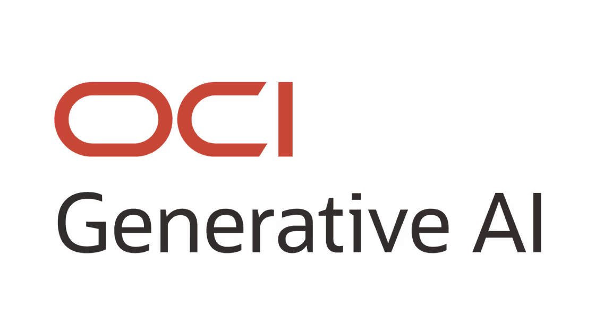

    <h1 align = "center">
    <b>OCI Generative AI Service</b>
    </h1>

This module covers the core capabilities of the Oracle Cloud Infrastructure Generative AI service, such as:

- Using pre-trained foundational models
- Prompt engineering and LLM customization
- Fine-tuning and model inference
- Dedicated AI clusters
- Generative AI security architecture

You can find the Skill Check Questions at [`QUESTIONS.md`](./QUESTIONS.md)

Similarly, you can find the Module Labs at [`./code`](./code).

## Table of Contents

1. [OCI Generative AI](#oci-generative-ai)
2. [Chat Models](#chat-models)
3. [Embedding Models](#embedding-models)
4. [Prompt Engineering](#prompt-engineering)
5. [Fine Tuning](#fine-tuning)
6. [Dedicated AI Clusters](#dedicated-ai-clusters)
7. [OCI Generative AI Security](#oci-generative-ai-security)

---

## OCI Generative AI

The **OCI Generative AI Service** is a fully managed service that provides a set of customizable Large Language Models (
LLMs) available via a single API to build generative AI applications.

As it is used via a single API, it allows flexibility to use different foundational models with minimal code changes. It
is also of serverless nature, so there is no need to manage any kind of infrastructure.

There are three key characteristics of the service:

- **Choice of models**: Provides high-performing pre-trained foundational models from Meta and Cohere.
- **Flexible fine-tuning**: Create custom models by fine-tuning foundational models with a custom dataset.
- **Dedicated AI clusters**: GPU based compute resources that host fine-tuning and model inference workloads.

### How does OCI Generative AI service work?

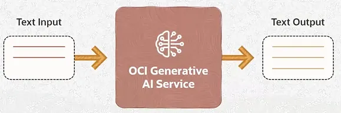

The OCI Generative AI Service works by following the steps below:

1. Users provide text in a natural language prompt (e.g: "Describe what is OCI GenAI Service?")
2. The GenAI service processes the input to generate, summarize, transform, extract information or classify text.
3. The generated response is sent back to the user.

### Pre-trained Foundational Models

In OCI GenAI, there are two types of pre-trained foundational models: chat models and embedding models.

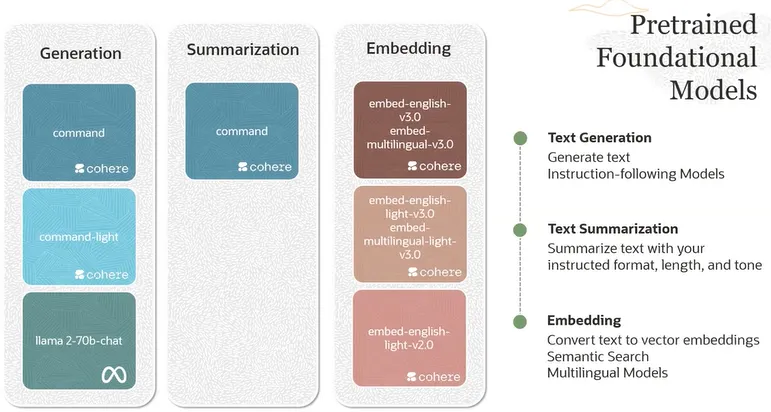

### Foundational models and fine-tuning

OCI GenAI allows for tine-tuning, which optimizes pre-trained foundational models on smaller domain-specific data to
create customized models.

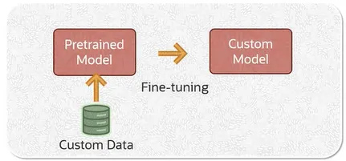

The two main benefits of the fine-tuning process are:

- **_Improved model performance_** on domain-specific tasks.
- **_Increased model efficiency_** by reducing the token usage.

The OCI Generative AI Service enables T-Few fine-tuning a PEFT (_parameter efficient fine-tuning_) which enables fast
and efficient model training, that updates only a fraction of the model's weights.

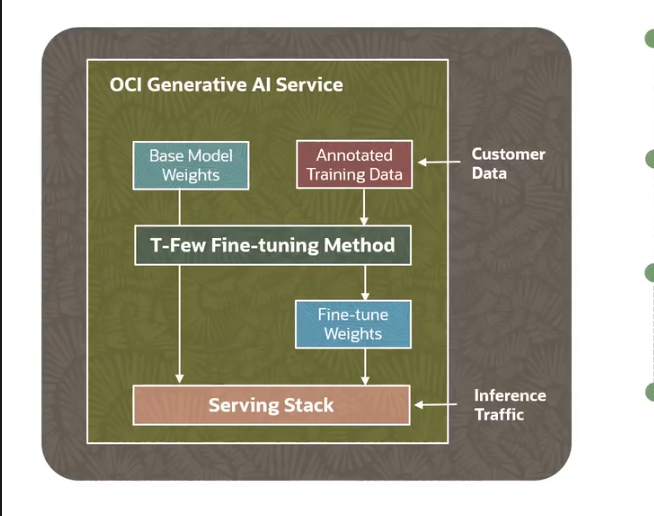

### Dedicated AI Clusters

OCI GenAI provides **Dedicated AI Clusters** which are GPU based compute resources that host the customer's fine-tuning
and model inference workloads.

When the GenAI service establishes a dedicated AI cluster, it includes dedicated GPUs and an exclusive RDMA cluster
network for connecting the GPUs.

The GPUs allocated for a given customer's Generative AI tasks are isolated from any other GPUs.

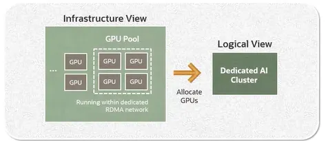

## Chat Models

### Tokens

Language models understand tokens rather than characters, where one token can be a part of a word, an entire word or
punctuation.

For instance, a common word such as "_apple_" is a single token, while another word such as "_friendship_" is made
up of two tokens: "_friend_" and "_ship_". Hence, the number of tokens per word dependes on the complexity of the text.

So, simple words generally average one token, while complex words can be compose from 2-3 tokens per word.

Furthermore, a _**tokenizer**_ is a component that takes a sentence in natural language and breaks it down into
multiple tokens.

## Pre-trained Chat Models

Here is an overview of the available pre-trained Chat Models in the OCI Generative AI service:

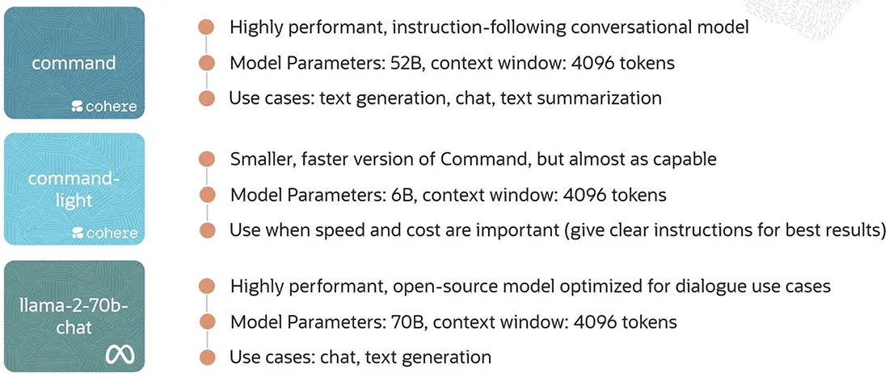

## Model Inference Parameters

Inference parameters can change the pool of possible outputs that the model considers during response generation, or
they can also limit the final response

Some of the chat model inference parameters in OCI Generative AI are:

* **Maximum Output Tokens**: as stated, it is the maximum amount of tokens that the model generates per response (up to
  4,000 in OCI).
* **Preamble Override**: An initial guideline message that can change the model's overall chat behavior and conversation
  style, the system prompt.
* **Temperature**: a hyperparameter that controls the randomness of the output. Higher values enable the model to
  generate more creative
  outputs, while low temperature values have more deterministic and predictable outputs.
* **Top k**: ensures that only the top k most likely tokens are considered in the response generation process at each
  step. 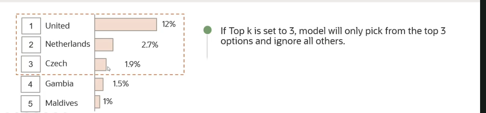
* **Top p**: ensures that only the most likely tokens with the sum p of their probabilities are considered for
  generation at each step. 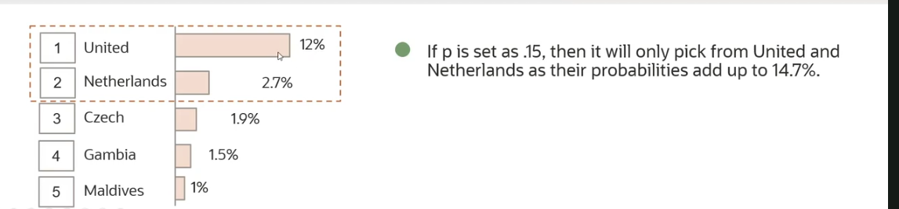
* **Frequency Penalty**: penalizes tokens that have already appeared in the preceding text (including the prompt), and
  scales based on how many times the token has appeared.
* **Presence Penalty**: applies a penalty if the token has appeared at least once before.
* **Show Likelihood**: determines how likely it would be for a token to follow the current generated token.

## Embedding Models

### Embeddings

Embeddings are a numerical representation of text converted into sequences of numbers (vectors).

A piece of text could be a word, a phrase, sentence or several paragraphs.

The embedding vectors help capture the semantic meaning of text and enable varios natural language processing tasks such
as semantic search, text classification and clustering.

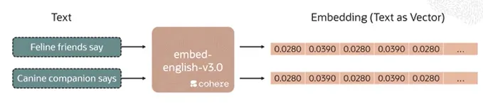

### Semantic Similarity

Cosine and dot product can be used to compute the numerical similarity between two embedding vectors.

Note that embeddings which are numerically similar are also semantically similar.

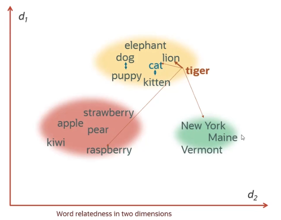

### Use cases

Some of the use cases for embedding models and embedding vectors are:

- Vector Search: Embeddings enable vector search, where the search function focuses on the meaning of text (
  semantic search) rather than keywords (lexical search).
- Text Classification: Embeddings help classify and label text based on their semantic similarity.
- Clustering: Embeddings also allow use to cluster similar text based on techniques such as dimensionality reduction and
  clustering using the embedding vectors.
- RAG: Retrieval augmentation enhances generative models by integrating them with retrieval systems, allowing them to
  fetch contextually relevant information at query time, and generate more accurate and grounded responses.

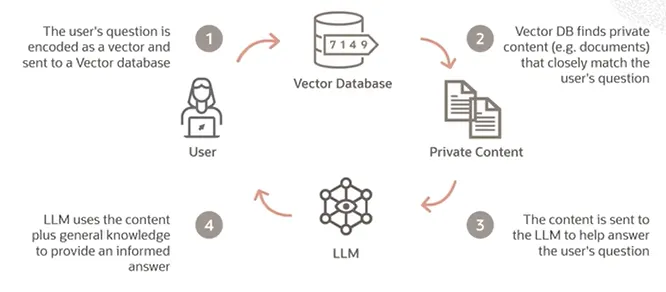

### Embedding Models in OCI Generative AI

The embedding models available in OCI Generative AI service include the following Cohere models:

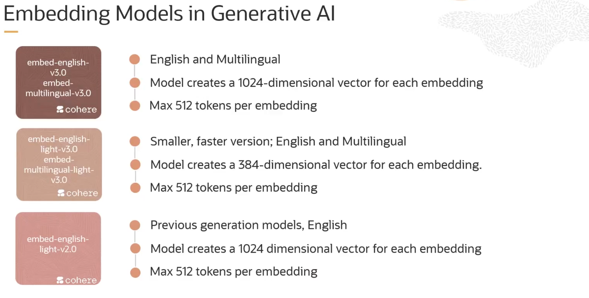

## Prompt Engineering

In the context of language models:

- A **prompt** refers to the initial input or text provided to the language model.
- **Prompt Engineering**: it is the process of iteratively refining a prompt in order to elicit a particular style of
  response in the language model.

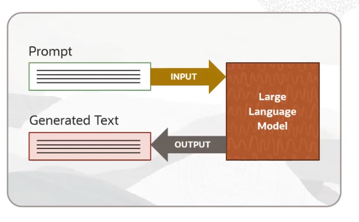

Note that language models can be seen as next-word predictors (or well, tokens), and the way they work is by basically
predicting the next series of tokens that is likely to follow from the previous text.
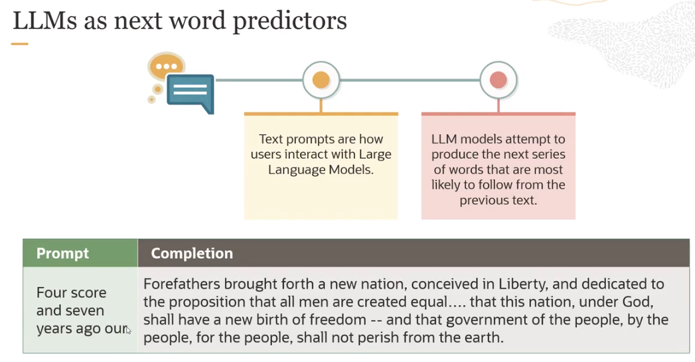

### In-context learning

**_In-context learning_**is the process of conditioning (by prompting) a language model with instructions and or
demonstrations of the task it is meant to complete.

Bear in mind, this is not learning in the traditional sense, as none
of the models weights are being adjusted.

### K-shot prompting / Few-shot prompting

_K-shot prompting_** is the prompt engineering technique of providing _k_ examples of the intended task in the prompt.
Also known as _few-shot prompting_.

It is widely believed to improve response generation over zero-shot prompting (not providing any examples within the
input context).

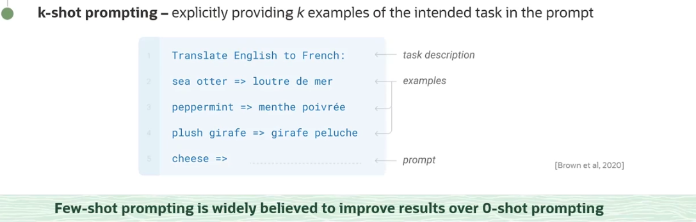

### Other Prompting Strategies

Some other advanced prompt engineering strategies are:

* **_Chain-of-thought_**: encourages the language model to generate intermediate reasoning steps before giving a final
  answer. The language model thinks out loud through a sequence of logical steps.
* **_Zero-shot chain-of-thought_**: Applies chain-of-thought prompting without providing examples.

## Fine Tuning

Some techniques used in order to customize the behavior of a language model can be seen below:

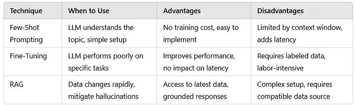

It is possible to combine these techniques in a single combined approach:

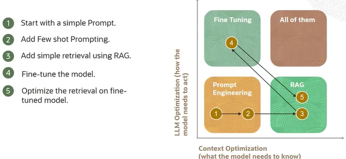

### Fine-tuning and model inference in OCI GenAI

A model is fine-tuned by taking a pretrained foundational model and providing additional training using custom data.

In machine learning, model inference refers to the process of using a trained machine learning model to make predictions
based on new input data. In the case of language models, inference refers to the model receiving new text as input and
generating output text based on what it has learned during training.

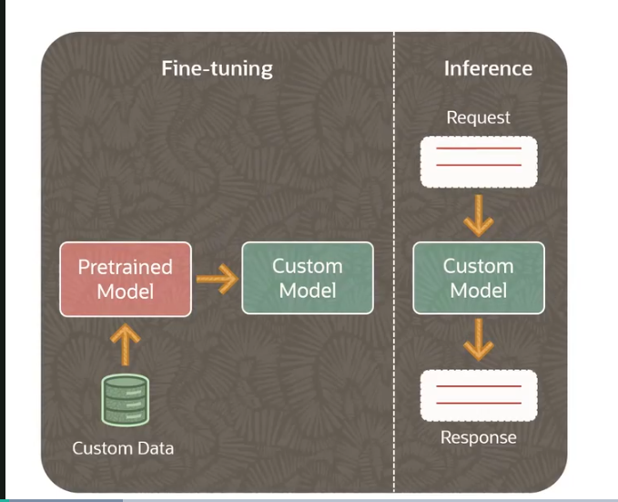

### OCI GenAI Fine-tuning

In the Oracle AI Generative AI service, we can use a custom dataset to fine-tune a foundational model and create a
**custom model**.

A typical fine-tuning workflow in OCI Generative AI, looks the following way:

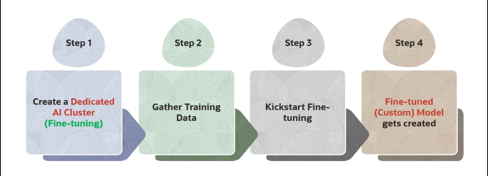

When creating a fine-tuning workflow in OCI GenAI service, there are the following configurations available:

- Training methods: fine-tuning is performed using PEFT techniques such as: T-Few or LoRA (Low-Rank Adaptation).
- Hyperparameters: there are several hyperparameters available, such as total training epochs, learning rate, training
  batch size, early stopping patience, early stopping threshold and log model metrics interval in steps.

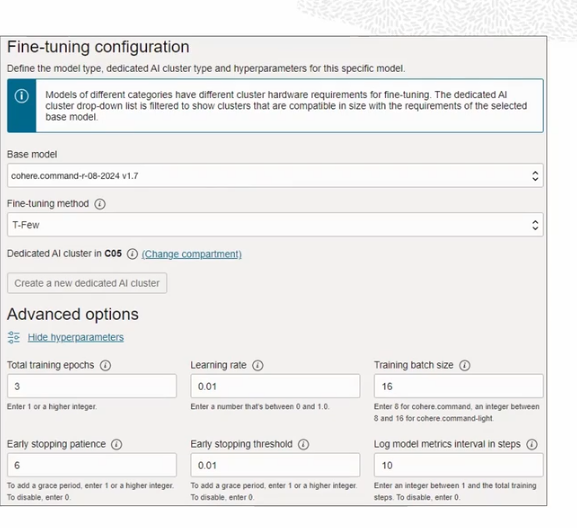

The hyperparameters options, their description and valid range can be visualized in the table below:

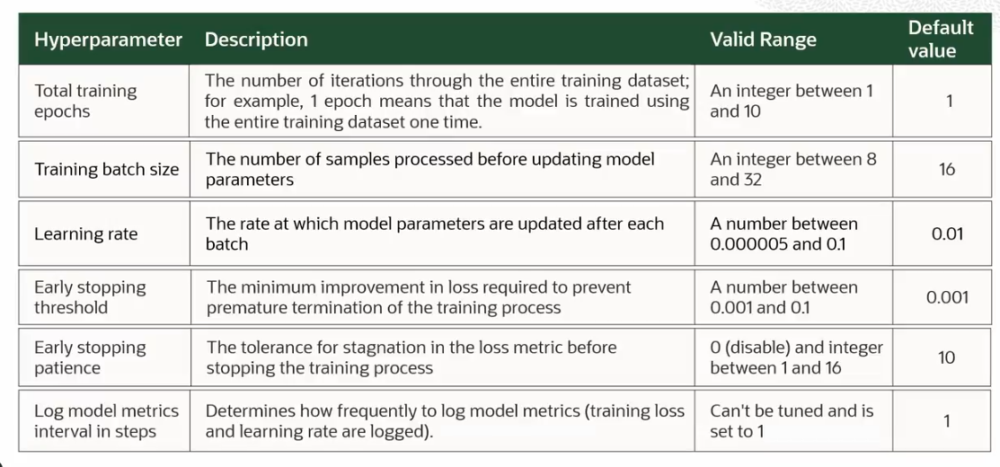

### Evaluating fine-tuning results

There are two main metrics used to understand the results of a fine-tuning process:

- **Accuracy**: Measures whether the generated tokens match the annotated tokens. E.g: an accuracy of 90% means that 90%
  of the output tokens matched the tokens in the dataset.
- **Loss**: Loss measures how wrong the generated output of a model are (a numerical penalty for mistakes). E.g: A loss
  of 0 means all outputs were perfect, a large loss indicates highly random outputs, loss decreases as the model
  improves.

### OCI GenAI Inference

On the other hand, it is possible to create a **model endpoint**, which serves as a designated point on a **Dedicated AI
Cluster** where an LLM can accept user requests and send back generated responses.

A typical inference workflow in OCI Generative AI looks just as shown below:

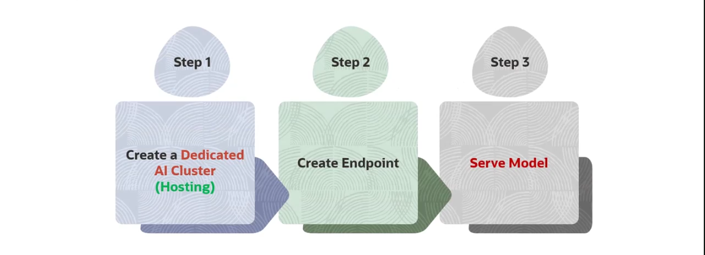

## Dedicated AI Clusters

In OCI GenAI, **Dedicated AI Clusters** are single-tenant deployment where the GPUs in the cluster only host your custom
models.

The cluster types is either **fine-tuning** (for training a pretrained foundational model) or **hosting** (hosts a
custom model endpoint for inference).

### Unit Types

There are four cluster unit types in OCI GenAI service:

- Large Cohere Dedicated: fine-tuning and hosting of Cohere Command R family, supports Command R+ 08-2024, Command R+.
- Small Cohere Dedicated: fine-tuning and hosting of Cohere Command R family, supports Comand R 08-2024, Command R.
- Embed Cohere Dedicated: Hosting of Cohere Embed models, supports Cohere English (light) Embed v3, Cohere
  Multilingual (light) Embed V3.
- Large Meta Dedicated: Fine-tuning and hosting of Meta Llama models, supports Meta Llama 3.3/3.1 (70B), Meta Llama 3.2
  11B/90B Vision, Meta Llama 3.1 (405B).

### Cluster Unit Sizing

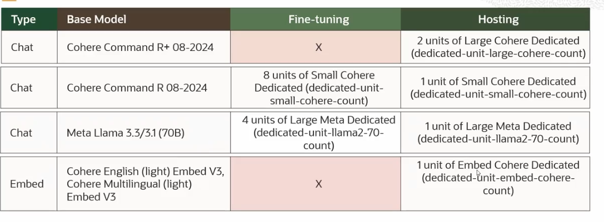

### Cluster Unit Pricing

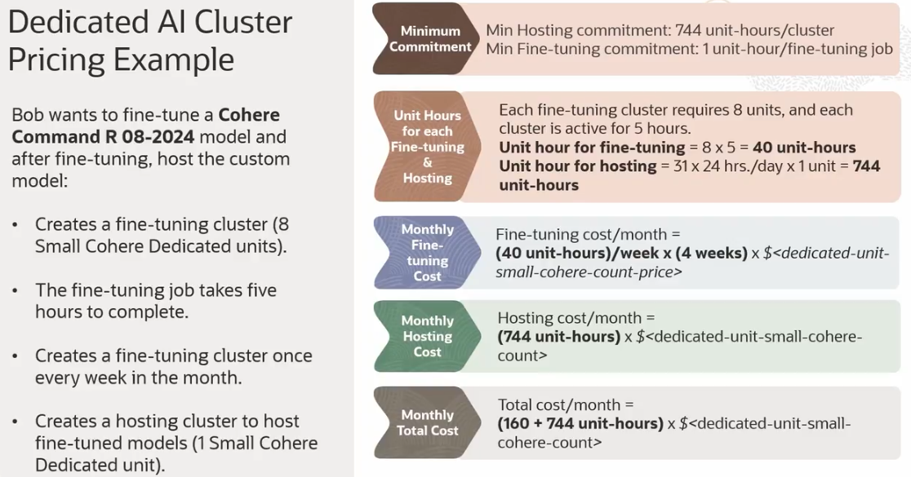

## OCI Generative AI Security

### Dedicated GPU and RDMA Network

In OCI GenAI, security and privacy of a customer is an essential design tenet: the GPU allocated for a customer's
generative AI tasks are isolated from other GPUs.

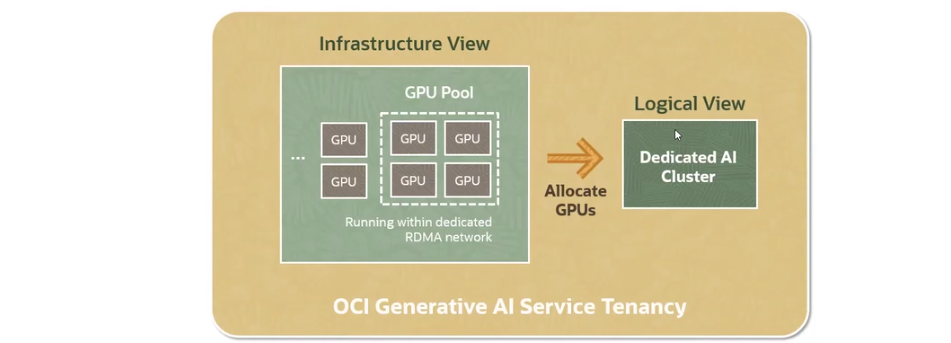

On the other hand, for strong data privacy and security, a dedicated GPU cluster only handles fine-tuned models of a
single customer.

Base model + fine-tuned models endpoints share the same cluster resources for the most efficient utilization of
underlying GPUs in the Dedicated AI Cluster. They all run under the dedicated RDMA network.

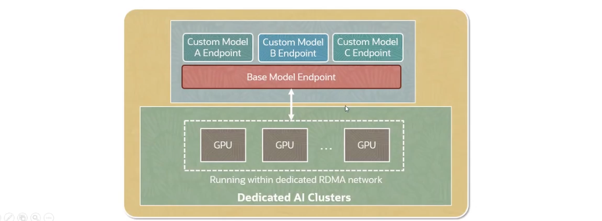

### Customer Data and Model Isolation

Customer data access is restricted within the customer's tenancy, so that one's customer's data can't be seen by another
customer.

Only a customer's application can access custom models created and hosted from within that customer's tenancy.

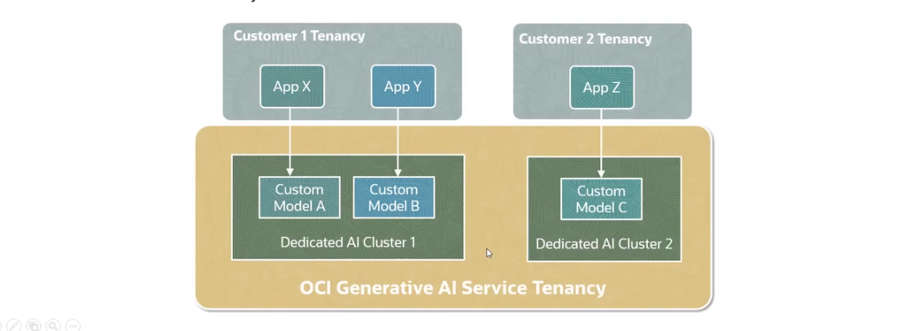

### OCI Security Services

The OCI GenAI service also leverages other OCI Security services, such as:

- Leverages OCI IAM for authentication and authorization.
- OCI Key Management service stores base model keys securely.
- The fine-tuned customer models weight are stored in OCI Object Storage buckets (encrypted by default).

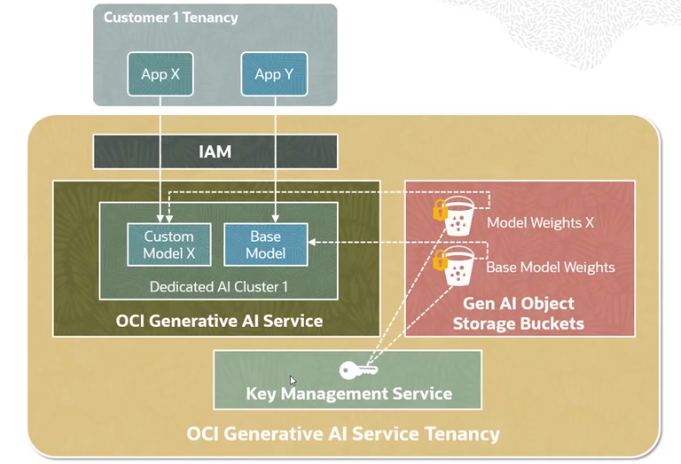
