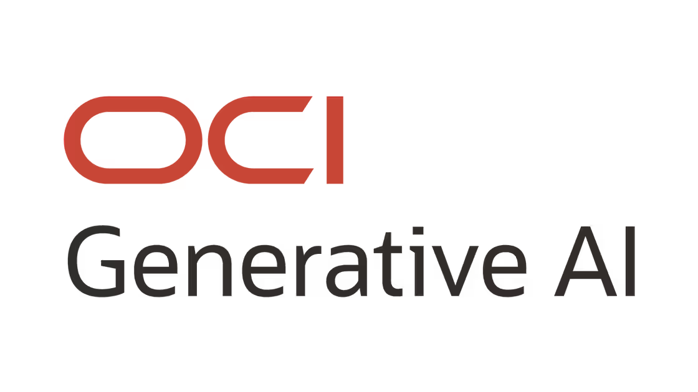

<p align="center">
  
</p>

<div align="center">
    <h1 align = "center">
    <b>OCI Generative AI Service</b>
    </h1>
</div>

This module covers the use of OCI Generative AI service and Oracle 23 ai Vector Search, in order to perform
Retrieval-Augmented Generation (RAG).

Some of the topics it covers are:

- OCI Generative AI Integrations
- RAG
- Processing, embedding and storing
- Retrieval and generation
- LangChain Basics
- Conversational RAG

You can find the Skill Check Questions at [`QUESTIONS.md`](./QUESTIONS.md)

Similarly, you can find the Module Labs at [`./code`](./code).

## OCI Generative AI and LangChain

LangChain is an open-source framework for developing applications powered by language models.

If offers a multitude of components that help us build LLM-powered applications. A few of the components LangChain has
in order to build a LLM-powered integration (like a ChatBot) are:


### LangChain Models

LangChain provides a standardized interface to access several types of models, such as large language models, but also
embedding models and chat models.


### LangChain Prompts

LangChain prompts can be created using two types of LangChain prompt templates: String prompt templates and Chat prompt
templates.


### LangChain Chains

LangChain's chains give its name to the framework, and they give the ability of chaining multiple LangChain components
together — like prompts, models, and output parsers — into a single, reusable workflow.


A common chain interaction is shown in the following workflow:


### LangChain Memory

Memory is the ability to store information about past interactions.

Chain interacts with the memory twice in a run, as shown below:


## OCI Generative AI and Oracle DB

Oracle Database 23ai can be used as a vector store, and LangChain offers Python classes to store and search embeddings
in Oracle Database 23ai.


## Retrieval-Augmented Generation (RAG)

Retrieval-augmented generation (RAG) is a method for generating text using additional information fetched from an
external data source.

RAG models retrieve documents and pass them to _seq2seq_ models. This technique allows us to mitigate bias in training
data and overcome model limitations, as well as handle a broader range of queries without re-training the model.

### RAG Pipelines

RAG is mainly composed of 3 phases:

1. Ingestion: Documents are ingested into the system. The documents are loaded, then broken down into chunks, embedded
   and then indexed into a database.
2. Retrieval: The system uses the indexed data to find relevant information. A user inputs a question, which is then
   used to search through the stored embeddings via the index. From the retrieved documents, the system selects the top
   K most relevant chunks to the query.
3. Generation: With the top k results, this is passed on in the context of the language model and used for response
   generation, which is then sent to the user.


### Step 1 - Ingestion

#### Document Loading

Document Loaders (`DocumentLoader`) are responsible for loading documents from a variety of sources. Some of the most
common document formats are PDF, CSV, HTML, JSON and Markdown.

#### Chunking

Once the documents are loaded, the next step is to chunk them. Text Splitters (`TextSplitter`) take a document and split
them into several chunks that can be later used information retrieval.

If we split documents into smaller chunks, this helps us fit in into the context window of the language model.
Nevertheless, if we make chunks too small they may not be semantically meaningful, and if we make them too big they
might not be semantically specific.

> Chunk overlap is the number of overlapping characters between adjacent chunks, which helps preserve context and create
> a richer prompt.

Splitting methods help decide when a document is split until the chunks are small enough. The default list of separators
include ["\n\n", "\n", "", ""].

Here is some example code of data ingestion using LangChain:

```python
from pypdf import PdfReader
from langchain.text_splitter import RecursiveCharacterTextSplitter
from langchain_core.documents import BaseDocumentTransformer, Document

# Load the document and create pdf reader object
pdf = PdfReader('./pdf-docs/oci-ai-foundations.pdf')
# Transform the document to text
text = ""
for page in pdf.pages:
    text += page.extract_text()
print("You have transformed the PDF document to text format")
# Chunk the text document into smaller chunks
text_splitter = RecursiveCharacterTextSplitter(chunk_size=2000, chunk_overlap=100)
chunks = text_splitter.split_text(text)
```

#### Embedding

Once the documents are split into chunks, these text chunks are then transformed into embedding vectors, which transform
the text into vectors that capture its semantic meaning.

In order to generate embeddings, an embedding model is used.


In the case of Oracle Database 23ai, embeddings can be
generated outside the database using 3rd-party embedding models (e.g: OpenAI) or within the database (with ONNX and
ONNX-Runtime).

Embeddings are stored into Oracle Database using the `VECTOR[]` data type (introduced in Oracle Database 23ai) and
indexed with either of `IVFFLAT` or `HNSW` index formats.

```python
from langchain_community.embeddings import OCIGenAIEmbeddings
from langchain_community.vectorstores import OracleVS
from langchain_community.vectorstores.utils import DistanceStrategy

# Using an embedding model, embed the chunks as vectors into Oracle Database 23ai.
embed_model = OCIGenAIEmbeddings(
    model_id="cohere.embed-english-v3.0",
    service_endpoint="https://inference.generativeai.eu-frankfurt-1.oci.oraclecloud.com",
    compartment_id="...",
    auth_type="..."
)

# Configure the vector store with the model, table name, and using the indicated
# distance strategy for the similarity search and vectorize the chunks
knowledge_base = OracleVS.from_documents(docs, embed_model, client=conn23c,
                                         table_name="DEMO_TABLE", distance_strategy=DistanceStrategy.DOT_PRODUCT)
```

### Retrieval

In order to perform information retrieval, a user query is encoded using the same embedding model used to encode the
chunks.

Then a database fires a semantic search to search for the top k most similar chunks.


### Augmented-Generation

Once the top k most similar chunks are found, these are inserted into the context window of the language model and used
for response generation, which is used to provide an informed answer and then sent back to the user.


```python
from langchain.chains import RetrievalQA
from langchain_community.chat_models.oci_generative_ai import ChatOCIGenAI
from langchain_community.vectorstores import OracleVS

# Initialize the vector store object
vs = OracleVS(embedding_function=embed_model, client=conn23c, table_name="DEMO_TABLE",
              distance_strategy=DistanceStrategy.DOT_PRODUCT)

# Create a retriever from the vector store
retv = vs.as_retriever(search_type="similarity", search_kwargs={'k': 3})

# Initialize the Large Language Model (LLM) for the Q&A
llm = ChatOCIGenAI(
    model_id="cohere.command-r-16k",
    service_endpoint="...",
    compartment_id="...",
    auth_type="..."
)

# Create the Retrieval-Augmented Generation (RAG) chain
chain = RetrievalQA.from_chain_type(llm=llm, retriever=retv, return_source_documents=True)

# Invoke the chain with a question
response = chain.invoke("Tell us which module is most relevant to LLMs and Generative AI")
```

### Conversational RAG

Conversational RAG extends regular RAG to handle multi-turn, context-aware conversations.

It not only retrieves relevant documents but also:

- Keeps track of conversation history
- Uses that history to refine what to retrieve
- Ensures answers stay consistent and contextual over time

Here's are some components of conversational RAG for Chatbots:

