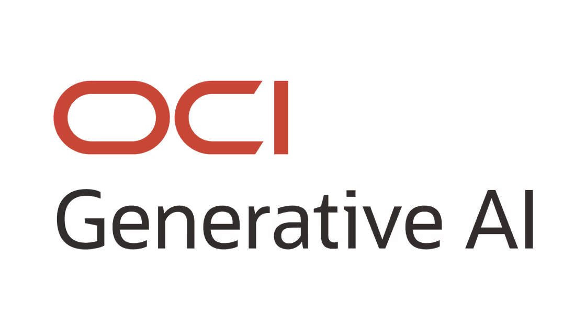
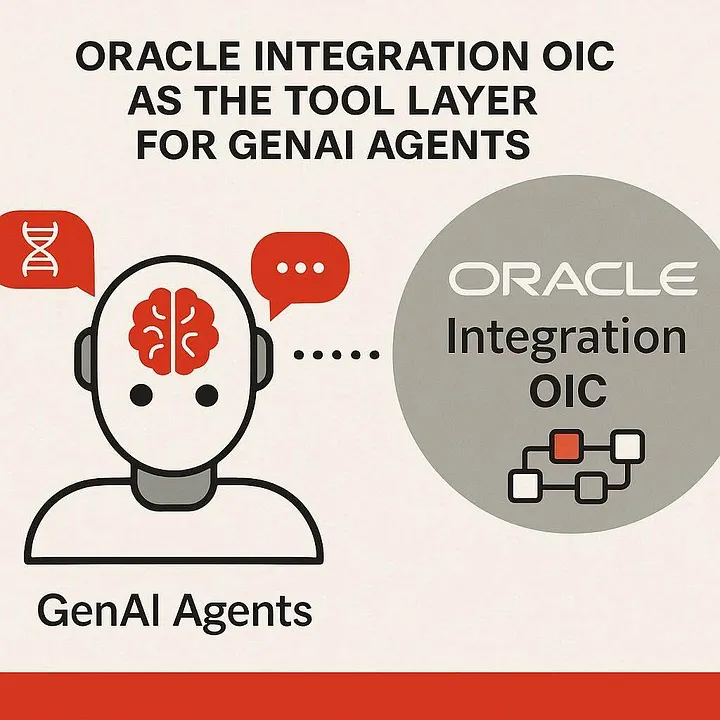
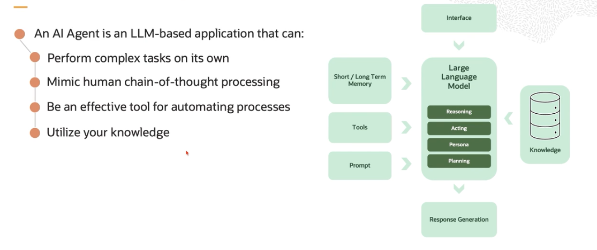
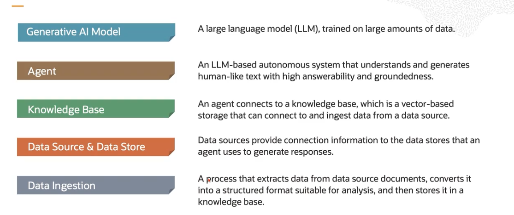
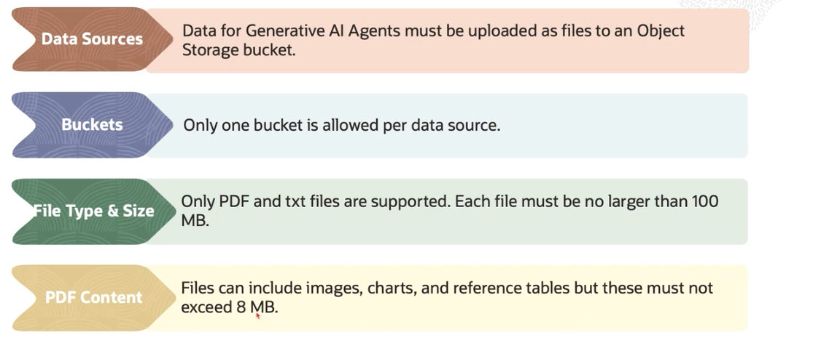
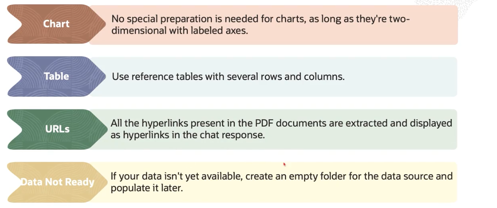
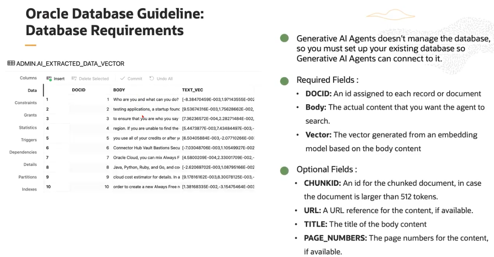
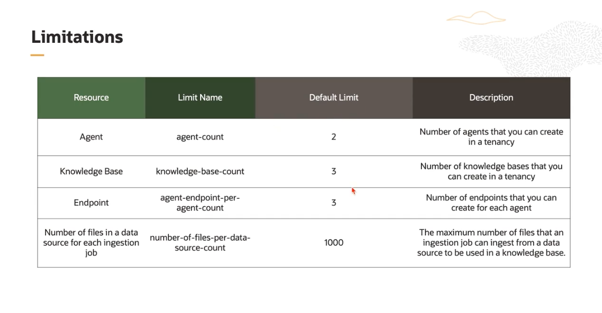

  

    <h1 align = "center">
    <b>OCI Generative AI Agents</b>
    </h1>

This module covers the use of the OCI Generative AI Agents service.

You can find the Skill Check Questions at [`QUESTIONS.md`](./QUESTIONS.md)

Similarly, you can find the Module Labs at [`./code`](./code).

## OCI Generative AI Agents

OCI Generative AI Agents service is a fully-managed cloud service that lets organizations build, deploy and manage AI
Agents, which combine the capabilities of LLMs, plus tools and workflows to automate tasks, answer questions, interact
conversationally, and connect to enterprise data.

### AI Agent Architecture

### AI Agents Concepts

Some of the vital concepts of Agents are:

- **Generative AI Model**: A large language model (LLM), trained on large amounts of data.
- **Agent**: An LLM-based autonomous system that understands and generates human-like text with high answerability and
  groundedness.
- **Knowledge Base**: An agent connects to a knowledge base, which is a vector-based storage that can connect to an
  ingest data from a data source.
- **Data Source & Data Store**: Data sources provide connection information to the data stores that an agent uses to
  generate responses.
- **Data Ingestion**: A process that extracts data from data source documents, converts it into a structured format
  suitable for analysis, and then store it in a knowledge base.

- **Session**: A series of exchanges where the user sends queries or prompts, and the agent responds with relevant
  information.
- **Agent Endpoint**: Specific points of access in a network or system that agents use to interact with other systems or
  services.
- **Trace**: Feature to track and display the conversation history (both the original prompt and the generated response)
  during a chat conversation.
- **Citation**: The source of information for the agent's response.
- **Content moderation**: Feature designed to help detect or filter out certain toxic, violent, abusive and hateful
  behaviour from generated responses or user prompts.

## Object Storage Guideline

- **Data sources**: Data for Generative AI agents must be uploaded as files to an Object Storage bucket.
- **Buckets**: Only one bucket is allowed per data source.
- **File type and size**: Only pdf and txt files are supported, each file must be no larger than 100mb.
- **PDF Content**: Files can include images, charts, reference tables, bust must not exceed 8MB.

## Oracle Database Guideline

## Limitations

