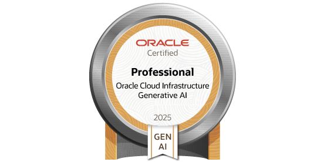
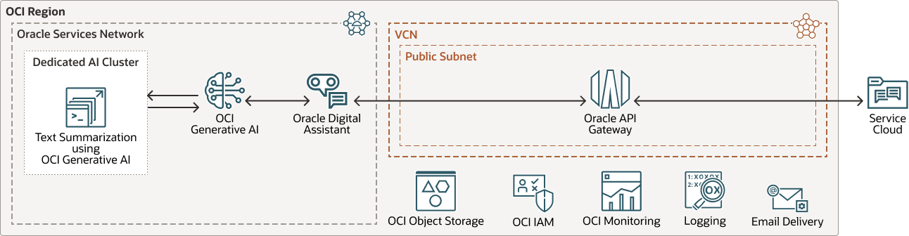

 

  <a href="#">
   <!-- Replace this logo for a custom official logo -->
    
  </a>

<h1 align = "center">
<b>OCI Generative AI Professional</b>
</h1>
    <!-- Add/Remove categories depending on your project -->
  

    Learning Materials from <i>OCI Generative AI Professional</i>
     
    <!-- IMPORTANT NOTE: If you want to append emojis you'll need to add the '-' sign before and after the header, as shown below:  -->
    <a href="#-modules-">Modules</a>
    ·
    <a href="#-requirements-">Requirements</a>
    ·
    <a href="#-license-">License</a>
  

This repository contains the scripts, answers & solutions to the Oracle MyLearn Training for the Oracle Cloud
Infrastructure (OCI) Generative AI Professional Certification.

## ⏳ Progress ⏳

| ID | Module                                        | Progress |
|----|-----------------------------------------------|----------|
| 1  | Course: OCI Generative AI Professional        | :x:      |
| 2  | Practice Exam: OCI Generative AI Professional | :x:      |

## 🚀 Modules 🚀

### [Course Section 1.2: Fundamentals of Large Language Models](./01-oci-generative-ai-professional/02-fundamentals-llm)

* Introduction to Large Language Models
* LLM Architectures: Encoder, Decoder & Encoder-Decoders
* Prompting / Prompt Engineering
* Model Training: Fine-tuning (FT), PEFT, Soft Prompting, Continual Pre-training
* Decoding
* Hallucinations
* LLM Applications

### [Course Section 1.3: OCI Generative AI Service](./01-oci-generative-ai-professional/03-oci-genai)

* Introduction to OCI Generative AI
* Chat Models & Embedding Models
* OCI Generative AI Inference API
* Fine-tuning, custom models and inference in OCI Generative AI
* Dedicated AI Clusters: sizing and pricing
* OCI Generative AI Security

### [Course Section 1.4: RAG with OCI Generative AI + Oracle 23ai Vector Search](./01-oci-generative-ai-professional/04-oci-genai-rag)

* OCI Generative AI Integrations
* Retrieval Augmented Generation
* Processing, embedding and storing documents
* Retrieval and generation with LangChain
* Conversational RAG
* Oracle Database 23ai for RAG

### [Course Section 1.5: Chatbots using OCI Generative AI Agent Service](./01-oci-generative-ai-professional/05-oci-genai-agent)

* OCI Generative AI Agent Service
* Chatbot using Object Store / Oracle Database 23ai

### [Module 4: Practice Exam](02-practice-exam/)

* Practice Exam: Questions & Solutions

(<a href="#readme-top">back to top</a>)

## 🛠️ Requirements 🛠️

TBD.

(<a href="#readme-top">back to top</a>)

<!-- This is a custom version of the Read-My-README template, by Jon Areas, 
found at: https://github.com/jxareas/read-my-readme -->
